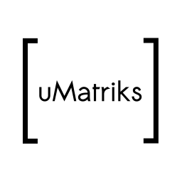

# uMatriks
uMatriks is a Matrix protocol client for Ubuntu Touch.

To have more information or to talk about this app, join the room:
`#uMatriks:matrix.org`

To know more about Matrix go to https://matrix.org/

## Translate
You can help translating the app visiting this link: https://poeditor.com/join/project/Og2UosRdlD

## Thanks

The application makes use of the [libqmatrixclient](https://matrix.org/docs/projects/sdk/libqmatrixclient.html "libqmatrixclient") developed by Felix Rohrbach kde@fxrh.de and others. The source code can be found in https://github.com/QMatrixClient/libqmatrixclient

`#quaternion:matrix.org`

This application also takes important parts of the code base of [Tensor](https://matrix.org/docs/projects/client/tensor.html "Tensor") by David A. Roberts, Roman Plášil and others. The source code of tensor can be found in https://github.com/davidar/tensor

`#tensor:matrix.org`

## Pre-requisites
Ubunu-SDK (this section will vary with the clickable environment inclusion).

## Building
Compile using the sdk and then create a .click file.

Note: _Instructions to build this app with [clickable](https://wiki.ubports.com/wiki/Set-up-an-app-development-environment 'clickable') will be released soon._

## Installation
There are different ways to install this app in a phone.

- Use the Ubuntu-SDK to install the created click package.
- Send to yourself the click package over wire, or over telegram, and open the file with the OpenStore app.
- more soon...

## App development
This is the initial release of the uMatriks app. There are several things to improve, both in the usability as in the features side.

In this moment, you can not create a new user within the app. In order to do so, go to https://riot.im/app .

### Build without SDK
This explains how to compile && build the app without the the SDK.

    $ sudo apt-get install git-core click qmake
    $ git submodule update --init
    $ qmake
    $ make
    $ ./uMatriks/uMatriks
    $ click build .

#### Build for ARM

The steps are essential the same we only need to setup a arm qemu container.

First we create a container:

    sudo lxc-create -n vivid-armhf -t ubuntu -- -b utouch -a armhf -r vivid

Edit the config and add mounts and network support:

    sudo nvim /var/lib/lxc/vivid-armhf/config
    # Template used to create this container: /usr/share/lxc/templates/lxc-ubuntu
    # Parameters passed to the template: -b utouch -a armhf -r vivid
    # Template script checksum (SHA-1): 704a37e3ce689db94dd1c1a02eae680a00cb5a82
    # For additional config options, please look at lxc.container.conf(5)

    # Uncomment the following line to support nesting containers:
    #lxc.include = /usr/share/lxc/config/nesting.conf
    # (Be aware this has security implications)

    ## Network
    lxc.utsname = vivid-armhf
    lxc.network.type = veth
    lxc.network.flags = up
    lxc.network.link = lxcbr0

    # Common configuration
    lxc.include = /usr/share/lxc/config/ubuntu.common.conf

    # Container specific configuration
    lxc.rootfs = /var/lib/lxc/vivid-armhf/rootfs
    lxc.rootfs.backend = dir
    lxc.utsname = vivid-armhf
    lxc.arch = armhf

    # Network configuration
    lxc.mount.entry = /home/utouch home/utouch none bind 0 0
    lxc.mount.entry = /opt/develop  opt/develop none bind 0 0

Start the container: 

    sudo lxc-start -n vivid-armhf

Connect to it:

    sudo lxc-console -n vivid-armhf
    # use your login go to /opt/develop and run the build commands

Stop it:

    sudo lxc-stop -n vivid-armhf
